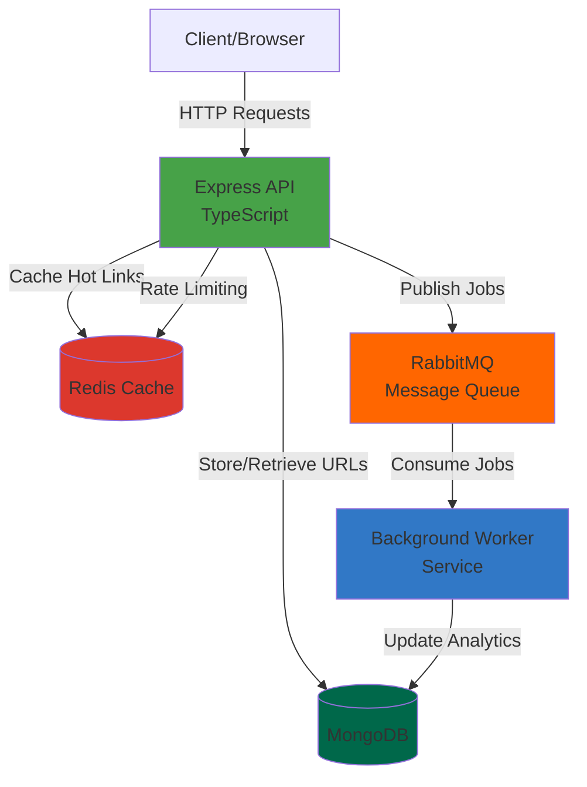

<div align="center">
    </img>
</div>

# URL Shortener

[](https://choosealicense.com/licenses/mit/)
[](https://nodejs.org/)
[](https://www.typescriptlang.org/)
[](https://expressjs.com/)
[](https://mongoosejs.com/)
[](https://redis.io/)
[](https://www.rabbitmq.com/)
[](https://www.docker.com/)

---

A URL shortener built with modern technologies. Features JWT authentication, real-time analytics, background job processing, and intelligent caching.

## Features

- **URL Shortening**: Convert long URLs into short, shareable links with base62 encoding
- **User Authentication**: JWT-based secure authentication with refresh tokens
- **Analytics Tracking**: Real-time visit counting and detailed analytics per URL
- **Background Processing**: Asynchronous job handling with RabbitMQ
- **Intelligent Caching**: Redis-based caching for top 100 most accessed links
- **Rate Limiting**: Redis-powered rate limiting to prevent abuse
- **Swagger Documentation**: Interactive API documentation

<!--
- **User Dashboard**: Manage your shortened URLs with statistics
--->

## Tech Stack

### Backend
- **Runtime**: Node.js 20+
- **Framework**: Express.js
- **Language**: TypeScript
- **Database**: MongoDB with Mongoose ODM
- **Cache**: Redis
- **Message Queue**: RabbitMQ
- **Authentication**: JWT
- **Testing**: Jest + Supertest
- **Documentation**: Swagger/OpenAPI 3

### DevOps
- **Containerization**: Docker + Docker Compose
- **CI/CD**: GitHub Actions
- **Architecture**: Microservices with package-by-feature structure

## Architecture



## Project Structure

```
url-shortener/
├── src/
│   ├── config/                   # App configuration & connections
│   ├── libs/                     # Shared utilities and helpers
│   ├── common/                   # Common resources (middlewares, errors, utils)
│   ├── modules/                  # Feature-based modules
│   │   ├── core/                 # Health checks & monitoring
│   │   ├── auth/                 # Authentication logic
│   │   ├── user/                 # User management
│   │   ├── url/                  # URL shortening & redirect
│   │   └── analytics/            # Analytics tracking
│   ├── app.ts                    # Express app setup
│   └── server.ts                 # Application entry point
├── tests/                        # Global test setup
├── .github/workflows/            # CI/CD pipelines
├── docker-compose.yml            # Production container setup
├── docker-compose.dev.yml        # Development container setup
├── Dockerfile                    # Production image
├── Dockerfile.dev                # Development image
└── package.json                  # Dependencies & scripts
```

## Getting Started

### Prerequisites

- Node.js 20+
- Docker & Docker Compose
- MongoDB (or use Docker)
- Redis (or use Docker)
- RabbitMQ (or use Docker)

### Installation

1. Clone the repository:
```bash
git clone git@github.com:Veras-D/url-shortener.git
cd url-shortener
```

2. Install dependencies:
```bash
npm install
```

3. Configure environment variables:
```bash
cp .env.example .env
```

Edit `.env` with your configuration:
```env
NODE_ENV=development
PORT=3000

MONGODB_URI=mongodb://localhost:27017/url-shortener
REDIS_URL=redis://localhost:6379
RABBITMQ_URL=amqp://localhost:5672

JWT_SECRET=your-jwt-secret
JWT_REFRESH_SECRET=your-refresh-secret
JWT_EXPIRES_IN=15m
JWT_REFRESH_EXPIRES_IN=7d

FRONTEND_URL=http://localhost:5173
```

4. Start with Docker Compose:
```bash
npm run compose:dev
```

5. Access the application:
   - Backend API: `http://localhost:3000`
   - API Documentation: `http://localhost:3000/api-docs`
   - RabbitMQ Management: `http://localhost:15672` (guest/guest)

### Development Setup

Start development server:

```bash
npm run dev
```

## API Endpoints

### Health Check
- `GET /health` - Service health status

### URL Management
- `POST /api/shorten` - Create short URL
- `GET /:shortCode` - Redirect to original URL
- `GET /api/urls` - Get user's URLs
- `DELETE /api/urls/:shortCode` - Delete short URL

### Analytics
- `GET /api/stats/:shortCode` - Get URL statistics

### Authentication
- `POST /api/auth/register` - Register new user
- `POST /api/auth/login` - User login
- `POST /api/auth/refresh` - Refresh access token
- `POST /api/auth/logout` - User logout

## Testing

### Run All Tests
```bash
npm test
```

### Watch Mode
```bash
npm run test:watch
```

### Test Coverage
```bash
npm run test:coverage
```

## Docker Deployment

### Development
```bash
npm run compose:dev
```

### Production
```bash
npm run compose:prod
```

### Debug Container
```bash
npm run debug
```

## Database Schema

### User Model
```typescript
{
  email: string;
  password: string;
  createdAt: Date;
}
```

### URL Model
```typescript
{
  originalUrl: string;
  shortCode: string;
  userId: ObjectId;
  visitCount: number;
  createdAt: Date;
}
```

### Analytics Model
```typescript
{
  shortCode: string;
  timestamp: Date;
  userAgent: string;
  ip: string;
}
```

## Available Scripts

| Script | Description |
|--------|-------------|
| `dev` | Start development server |
| `build` | Build TypeScript to JavaScript |
| `start` | Start production server |
| `test` | Run all tests |
| `lint` | Run ESLint |
| `lint:fix` | Run ESLint with auto-fix |
| `prettier` | Format code with Prettier |
| `compose:dev` | Start development environment |
| `compose:prod` | Start production environment |
| `debug` | Debug container shell access |

## Security Features

- JWT authentication with refresh tokens
- Password hashing with bcrypt
- Rate limiting per IP address
- CORS protection
- Security headers with Helmet
- Input validation
- Redis-based session management

## License

[MIT](LICENSE)

## Contributing

Contributions are welcome! Follow these steps to contribute to the project:

### 1. Pick or Create an Issue

- Browse existing [issues](https://github.com/Veras-D/url-shortener/issues) or create a new one
- Comment on the issue to let others know you're working on it
- Wait for approval from maintainers before starting work

### 2. Fork and Clone

```bash
git clone git@github.com:YOUR_USERNAME/url-shortener.git
cd url-shortener
```

### 3. Setup Development Environment

```bash
npm install
cp .env.example .env
```

Edit `.env` with appropriate values, then start services:

```bash
npm run compose:dev
```

### 4. Create a Feature Branch

```bash
git checkout -b feature/issue-number-short-description
```

Branch naming convention:
- `feature/123-add-custom-domains` for new features
- `fix/456-redirect-error` for bug fixes
- `docs/789-update-readme` for documentation
- `refactor/101-improve-cache` for refactoring

### 5. Develop Your Changes

- Write clean, maintainable code
- Follow the existing code structure and style
- Add tests for new features
- Update documentation if needed

### 6. Commit Your Changes

Use [Conventional Commits](https://www.conventionalcommits.org/) format:

```bash
git commit -m "feat: add custom domain support"
git commit -m "fix: resolve redirect loop issue"
git commit -m "docs: update API documentation"
git commit -m "test: add unit tests for url service"
```

Commit types:
- `feat`: New feature
- `fix`: Bug fix
- `docs`: Documentation changes
- `test`: Adding or updating tests
- `refactor`: Code refactoring
- `style`: Code style changes (formatting, etc.)
- `chore`: Maintenance tasks

### 7. Run Tests and Linting

Ensure all tests pass and code follows style guidelines:

```bash
npm run lint
npm run lint:fix
npm test
```

All checks must pass before submitting a PR.

### 8. Push and Create Pull Request

```bash
git push origin feature/issue-number-short-description
```

Then:
1. Go to the repository on GitHub
2. Click "New Pull Request"
3. Select your branch
4. Fill in the PR template with:
   - Description of changes
   - Related issue number
   - Screenshots (if applicable)
5. Wait for review from maintainers

### Code Review Process

- Maintainers will review your PR
- Address any requested changes
- Once approved, your PR will be merged

Thank you for contributing!

## Support

[](https://ko-fi.com/verivi)

---

<div align="center">
  <p>© 2025 VERAS. All rights reserved.</p>
</div>